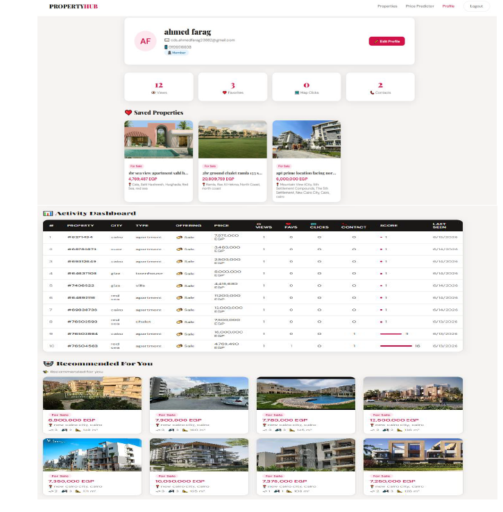
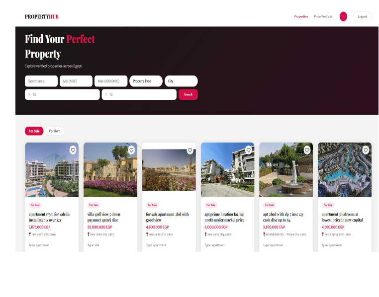
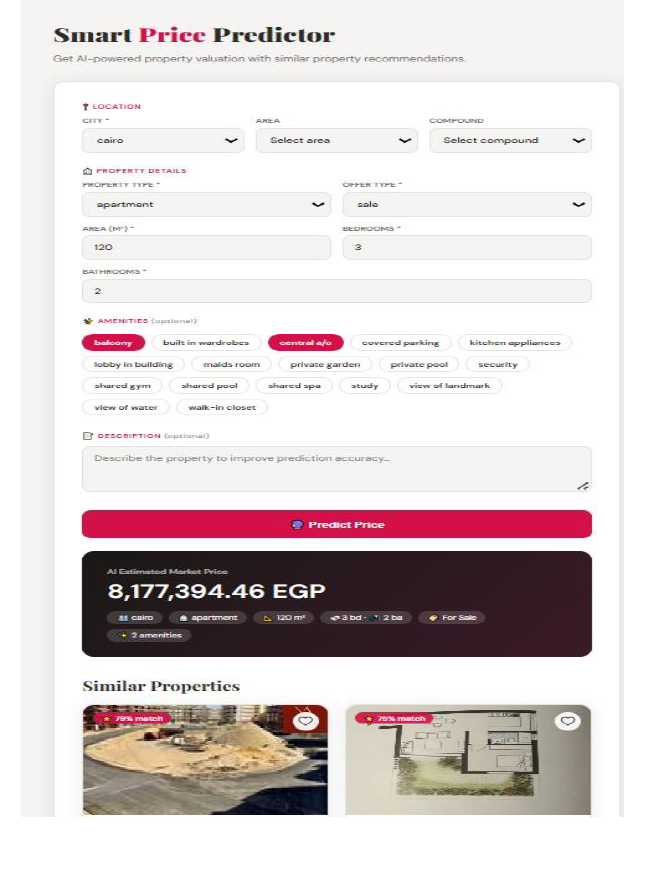
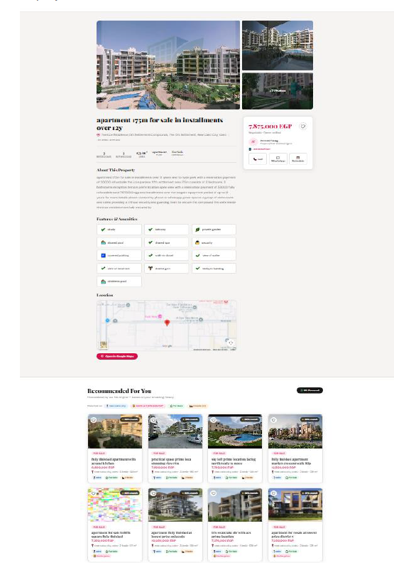

# 🏠 Property Hub AI

<div align="center">

### AI-Powered Real Estate Platform

**Discover • Recommend • Predict • Analyze**


</div>

---

# 🌟 Hero

Property Hub AI is a full-stack AI-powered real estate platform that combines **FastAPI**, **Machine Learning**, **MySQL**, and a responsive frontend to deliver intelligent property recommendations, price prediction, and analytics.

---

# 🎬 Demo

> Replace this section with a GIF after uploading one.

```md

```

---

# 🖼️ Gallery

| Home | Search |
|------|--------|
|  |  |

| Recommendation | Prediction |
|------|--------|
|  |  |

| Dashboard | Details |
|------|--------|
|  |  |

---

# 🏗️ Architecture


---

# 🤖 Machine Learning Pipeline

```text
Dataset
   ↓
Cleaning
   ↓
Feature Engineering
   ↓
LightGBM Training
   ↓
Evaluation
   ↓
Prediction API
```

---

# 🔄 Recommendation Pipeline

```text
Property Data
      ↓
TF-IDF
      ↓
Cosine Similarity
      ↓
Ranking
      ↓
Top Recommendations
```

---

# 📈 Workflow

```text
User
 ↓
Frontend
 ↓
FastAPI
 ├── Authentication
 ├── Property APIs
 ├── Recommendation
 ├── Prediction
 ↓
MySQL + ML Models
```

---

# 📋 Features

| Module | Status |
|--------|:------:|
| Authentication | ✅ |
| Property Search | ✅ |
| Recommendation System | ✅ |
| Price Prediction | ✅ |
| Favorites | ✅ |
| Analytics Dashboard | ✅ |
| Admin Panel | ✅ |

---

# 🛠️ Tech Stack

- Frontend: HTML, CSS, JavaScript
- Backend: FastAPI, SQLAlchemy
- ML: Python, LightGBM, Scikit-learn, TF-IDF
- Database: MySQL

---

# 🚀 Installation

```bash
git clone https://github.com/AhmedFarag555/Property-Hub-AI.git
cd backend
pip install -r requirements.txt
uvicorn main:app --reload
```

Swagger:
`http://localhost:8000/docs`

---

# 🛣️ Roadmap

- [x] Authentication
- [x] Recommendation System
- [x] Price Prediction
- [x] Analytics Dashboard
- [ ] Docker Deployment
- [ ] Cloud Deployment
- [ ] CI/CD
- [ ] Mobile App

---

# 📊 Project Statistics

| Metric | Value |
|--------|------:|
| Frontend | HTML/CSS/JS |
| Backend | FastAPI |
| Database | MySQL |
| ML Models | Recommendation + Price Prediction |
| Documentation | Report + Presentation + UML + ERD |

---

# 👨‍💻 Contributors

- Ahmed Farag

---

# 📜 License

MIT License

---

# 🙏 Acknowledgments

- Alexandria University
- Faculty of Computer and Data Science
- Open-source community

---

<div align="center">

## ⭐ Star this repository if you like it!

Built with ❤️ by **Ahmed Farag**

</div>
